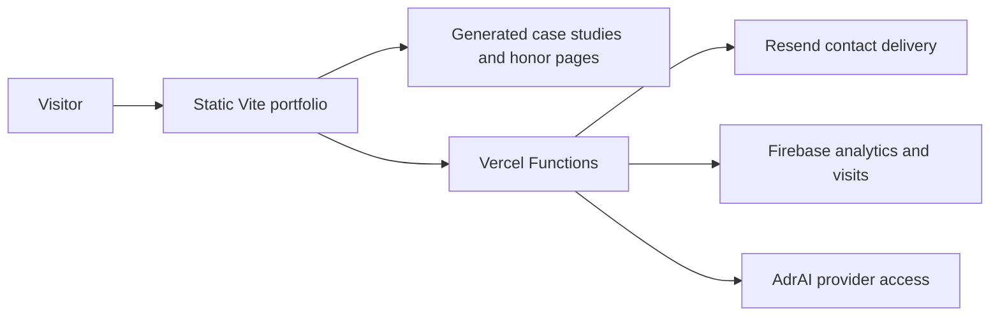

<div align="center">


# Adriel Magalona — Portfolio

### Portfolio website · selected work, case studies, and engineering notes

[](https://github.com/adr1el-m/portfolio/actions/workflows/performance.yml)
[](https://www.typescriptlang.org/)
[](https://vite.dev/)
[](https://vercel.com/)
[](LICENSE)

[Live site](https://adrielmagalona.dev) · [Case studies](https://adrielmagalona.dev/case-studies/worksight) · [GitHub](https://github.com/adr1el-m) · [LinkedIn](https://www.linkedin.com/in/adriel-magalona-0546b9318/) · [Report an issue](https://github.com/adr1el-m/portfolio/issues)

</div>

---

This repository powers [adrielmagalona.dev](https://adrielmagalona.dev), a portfolio built to make the work easy to evaluate: projects have context, achievements have evidence, and the site remains useful across devices and connection states.

| Focus | What is here |
| --- | --- |
| **Work** | Selected projects with role, scope, constraints, decisions, outcomes, and links. |
| **Evidence** | Build-generated, indexable case-study and honor pages. |
| **Experience** | Responsive navigation, keyboard-accessible dialogs, offline support, and tailored recruiter paths. |
| **Services** | Optional contact delivery, visitor analytics, and the server-side AdrAI portfolio guide. |

## Selected work

| Project | Focus | Evidence |
| --- | --- | --- |
| [WorkSight](https://adrielmagalona.dev/case-studies/worksight) | Product thinking and frontend delivery | Scope, decisions, and outcome |
| [GeneSync](https://adrielmagalona.dev/case-studies/genesync) | Algorithmic problem-solving | Implementation and demo evidence |
| [ODRS](https://adrielmagalona.dev/case-studies/odrs) | Full-stack workflow design | Architecture and source repository |
| [DokQ](https://adrielmagalona.dev/case-studies/dokq) | Document and queue experience | Product rationale and constraints |
| [LingapLink](https://adrielmagalona.dev/case-studies/lingaplink) | Team delivery and social impact | Role, results, and external proof |

## Built with

| Layer | Technology |
| --- | --- |
| Application | TypeScript · Vite · focused DOM modules |
| Platform | Vercel · Vercel Functions |
| Optional integrations | Firebase Realtime Database · Resend · Gemini |
| Quality | TypeScript · ESLint · Pa11y · Puppeteer · Lighthouse CI |

## Architecture at a glance



The portfolio shell, content pages, service worker, and offline fallback are static. Contact delivery, analytics, visits, and AdrAI use server endpoints so provider credentials never ship to the browser.

## Local setup

> **Requirement:** Node.js 24

```bash
npm ci
cp .env.example .env.local
npm run dev
```

The public portfolio runs without optional credentials. Enable only the services you need with the values documented in [.env.example](.env.example). Keep provider keys and server secrets out of `VITE_*` variables.

## Quality checks

Run the checks relevant to your change, or run the full suite before publishing:

```bash
npm run type-check      # TypeScript
npm run lint            # Static analysis
npm run build           # Production build + static page generation
npm run check:links     # Internal-link validation
npm run test:behavior   # Keyboard, dialog, route, and CTA smoke tests
npm run test:visual     # Visual-regression snapshots
npm run lighthouse:ci   # Lighthouse CI assertions
```

The production build writes the static honor and case-study pages to `dist/`.

## Design and engineering principles

- **Evidence over claims** — project pages describe the work, not just the stack.
- **Progressive enhancement** — useful core content remains available while richer interactions load when needed.
- **Accessible by default** — semantic controls, focus handling, and keyboard paths are covered by smoke checks.
- **Secrets stay server-side** — browser code never receives AI provider or privileged Firebase credentials.

## Deployment

Production is hosted on Vercel. Set optional Firebase, Resend, and AI credentials as **server-only** Vercel environment variables, then deploy:

```bash
npm run deploy
```

## Repository guide

```text
api/                 Vercel Functions
config/              Lighthouse and performance budgets
public/              Static media, styles, service worker, offline fallback
scripts/             Page generators and automated checks
src/data/            Portfolio, project, and case-study content
src/modules/         Page behavior and UI features
```

## License

Released under the [MIT License](LICENSE).
